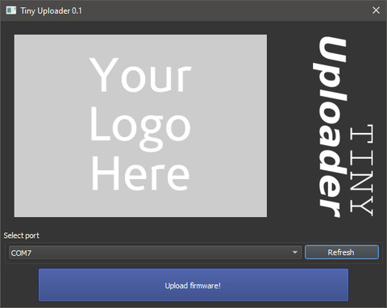
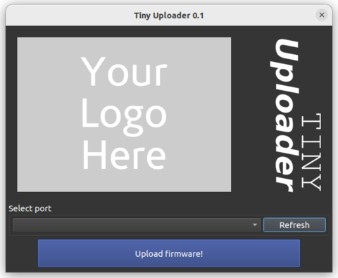

Tiny Uploader is a one-click tool that makes the task of flashing ESP32 boards simple.

If you have a project that creates ESP32 firmware, and you want to make it simple for your end-users to flash that firmware to their boards without needing to install the whole development tool-chain, Tiny Uploader can help.

Tiny Uploader is based on the <a href="https://github.com/tasmota/tasmotizer">Tasmotizer</a> project, and uses the Espressif <a href="https://github.com/espressif/esptool">ESPtool</a> under the hood.

This document will guide you through the process of making your own one-click uploader for your project.

## How to Generate a Custom Uploader

- Fork this project on GitHub and clone it to your local machine
- Customize `doc/images/banner.png` with your project logo
- Customize `firmwareURL.py` with the location of your firmware
- Push your changes to GitHub

That's it. A GitHub action will automatically build an executable for Windows, Linux and macOS. You can find the build outputs by clicking on the Actions tab, then the build workflow, and looking under Artifacts. You can download these executables and distribute them with your firmware releases. When your end-users run the Uploader it fetches the firmware from the URL you specified and programs it in to an attached ESP32.

## Notes

When you fork the Tiny Uploader project give it a custom name, for example `myproject-uploader`.

Tiny Uploader automatically downloads the firmware binary file at run-time from the URL that you specify. A good choice of location for your firmware is your GitHub project's Release download link. If you specify the URL using the `latest` tag, your Uploader will always get the latest firmware.

Some web browsers and/or operating systems may flag the Uploader executables as potentially dangerous since they are unsigned. If you have the capability, you may consider signing your executables.

## Screenshots

### Windows

### Ubuntu

## Credits

- (c) 2019 Jacek Ziółkowski https://github.com/jziolkowski
- (c) 2021 Oscar <4m1g0> https://github.com/4m1g0
- (c) 2022 Matthew Kendall https://github.com/mdkendall
